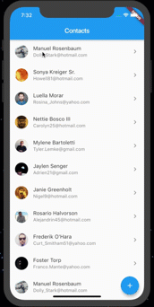

## Contacts App

### I learned how to:

- Work with route
- Work with models
- Use state manage to save the data
- Create list of users with avatar
- Load, Create and submit data using the http package
- Validate form inputs

Tools: dart, flutter, http, provider
