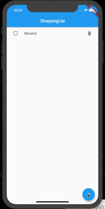

## Contacts App

### I learned how to:

- Display list of items
- Work with flutter redux
- Use state manage to save the data
- Use shared_preferences to save state into device

Tools: dart, flutter, flutter_redux, shared_preferences
